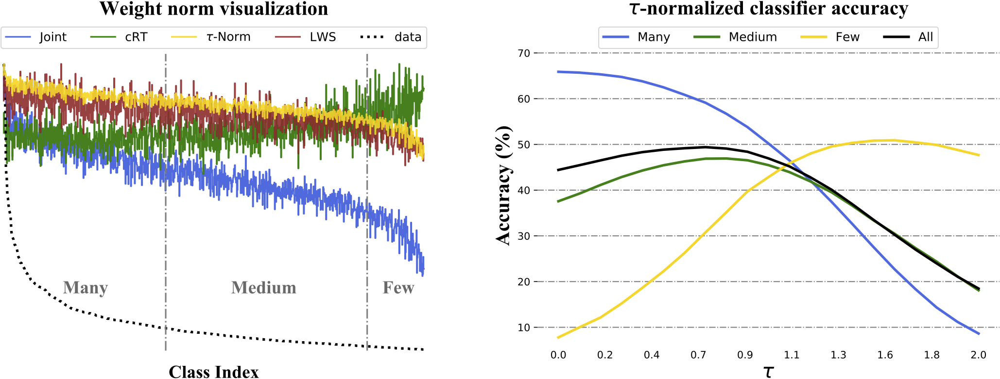

# Classifier-Balancing 
This repository contains code for the paper:

**Decoupling Representation and Classifier for Long-Tailed Recognition**  
[Bingyi Kang](https://scholar.google.com.sg/citations?user=NmHgX-wAAAAJ&hl=en), [Saining Xie](http://vcl.ucsd.edu/~sxie),[Marcus Rohrbach](https://rohrbach.vision/), [Zhicheng Yan](https://sites.google.com/view/zhicheng-yan), [Albert Gordo](https://agordo.github.io/), [Jiashi Feng](https://sites.google.com/site/jshfeng/), [Yannis Kalantidis](http://www.skamalas.com/)  
[[OpenReview](https://openreview.net/forum?id=r1gRTCVFvB)]
[[Arxiv](https://arxiv.org/abs/1910.09217)]
[[PDF](https://arxiv.org/pdf/1910.09217.pdf)]
[[Slides](https://docs.google.com/presentation/d/1ALgcp2RBaC7T9Pbgh4qciZ2gFSc_yV_ajfV78RCjLhs/edit?usp=sharing)]
[[@ICLR](https://iclr.cc/virtual/poster_r1gRTCVFvB.html)]  
Facebook AI Research, National University of Singapore  
_International Conference on Learning Representations (ICLR), 2020_


#### Abstract
The long-tail distribution of the visual world poses great challenges for deep learning based classification models on how to handle the class imbalance problem. Existing solutions usually involve  class-balancing strategies, e.g., by loss re-weighting, data re-sampling, or transfer learning from head- to tail-classes, but all of them adhere to the scheme of jointly learning representations and classifiers. In this work, we decouple the learning procedure into representation learning and classification, and systematically explore how different balancing strategies affect them for long-tailed recognition. The findings are surprising: (1) data imbalance might not be an issue in learning high-quality representations; (2) with representations learned with the simplest instance-balanced (natural) sampling, it is also possible to achieve strong long-tailed recognition ability with relative ease by adjusting only the classifier. We conduct extensive experiments and set new state-of-the-art performance on common long-tailed benchmarks like ImageNet-LT, Places-LT and iNaturalist, showing that it is possible to outperform carefully designed losses, sampling strategies, even complex modules with memory, by using a straightforward approach that decouples representation and classification.

&nbsp;
<p align="center">

</p>
&nbsp;


If you find this code useful, consider citing our work:
```
@inproceedings{kang2019decoupling,
  title={Decoupling representation and classifier for long-tailed recognition},
  author={Kang, Bingyi and Xie, Saining and Rohrbach, Marcus and Yan, Zhicheng
          and Gordo, Albert and Feng, Jiashi and Kalantidis, Yannis},
  booktitle={Eighth International Conference on Learning Representations (ICLR)},
  year={2020}
}
```

### Requirements 
The code is based on [https://github.com/zhmiao/OpenLongTailRecognition-OLTR](https://github.com/zhmiao/OpenLongTailRecognition-OLTR).
* Python 3
* [PyTorch](https://pytorch.org/) (version >= 0.4.1)
* [yaml](https://pyyaml.org/wiki/PyYAMLDocumentation)


### Dataset
* ImageNet_LT and Places_LT

  Download the [ImageNet_2014](http://image-net.org/index) and [Places_365](http://places2.csail.mit.edu/download.html).

* iNaturalist 2018

  * Download the dataset following [here](https://github.com/visipedia/inat_comp/tree/master/2018).
  * `cd data/iNaturalist18`, Generate image name files with this [script](data/iNaturalist18/gen_lists.py) or use the existing ones [[here](data/iNaturalist18)].

Change the `data_root` in `main.py` accordingly.

### Representation Learning 
1. Instance-balanced Sampling
```
python main.py --cfg ./config/ImageNet_LT/feat_uniform.yaml
```

2. Class-balanced Sampling
```
python main.py --cfg ./config/ImageNet_LT/feat_balance.yaml
```

3. Square-root Sampling
```
python main.py --cfg ./config/ImageNet_LT/feat_squareroot.yaml
```

4. Progressively-balancing Sampling
```
python main.py --cfg ./config/ImageNet_LT/feat_shift.yaml
```

Test the joint learned classifier with representation learning
```
python main.py --cfg ./config/ImageNet_LT/feat_uniform.yaml --test 
```

### Classifier Learning 
1. Nearest Class Mean classifier (NCM).
```
python main.py --cfg ./config/ImageNet_LT/feat_uniform.yaml --test --knn
```

2. Classifier Re-training (cRT)
```
python main.py --cfg ./config/ImageNet_LT/cls_crt.yaml --model_dir ./logs/ImageNet_LT/models/resnext50_uniform_e90
python main.py --cfg ./config/ImageNet_LT/cls_crt.yaml --test
```
   
3. Tau-normalization 

Extract fatures
```
for split in train_split val test
do
  python main.py --cfg ./config/ImageNet_LT/feat_uniform.yaml --test --save_feat $split
done
```
Evaluation
```
for split in train val test
do
  python tau_norm.py --root ./logs/ImageNet_LT/models/resnext50_uniform_e90/ --type $split
done
```

4. Learnable weight scaling (LWS)

```
python main.py --cfg ./config/ImageNet_LT/cls_lws.yaml --model_dir ./logs/ImageNet_LT/models/resnext50_uniform_e90
python main.py --cfg ./config/ImageNet_LT/cls_lws.yaml --test
```

### Results and Models

#### ImageNet_LT
- Representation learning  

  | Sampling               | Many  | Medium |  Few   |  All   | Model  |
  | ---------------------- |:-----:|:------:|:------:|:------:|:------:|
  | Instance-Balanced      | 65.9  |  37.5  |	7.7	  |  44.4  | [ResNeXt50](https://dl.fbaipublicfiles.com/classifier-balancing/ImageNet_LT/models/resnext50_uniform_e90.pth)|
  | Class-Balanced         | 61.8	|  40.1	 |  15.5	|  45.1  | [ResNeXt50](https://dl.fbaipublicfiles.com/classifier-balancing/ImageNet_LT/models/resnext50_balance_e90.pth)|
  | Square-Root            | 64.3	|  41.2	 |  17.0	|  46.8  | [ResNeXt50](https://dl.fbaipublicfiles.com/classifier-balancing/ImageNet_LT/models/resnext50_square_e90.pth)|
  | Progressively-Balanced | 61.9  |  43.2  |  19.4	|  47.2  | [ResNeXt50](https://dl.fbaipublicfiles.com/classifier-balancing/ImageNet_LT/models/resnext50_shift_e90.pth)|

  For other models trained with instance-balanced  (natural) sampling:  
  [[ResNet50](https://dl.fbaipublicfiles.com/classifier-balancing/ImageNet_LT/models/resnet50_uniform_e90.pth)]
  [[ResNet101](https://dl.fbaipublicfiles.com/classifier-balancing/ImageNet_LT/models/resnet101_uniform_e90.pth)]
  [[ResNet152](https://dl.fbaipublicfiles.com/classifier-balancing/ImageNet_LT/models/resnet152_uniform_e90.pth)]
  [[ResNeXt101](https://dl.fbaipublicfiles.com/classifier-balancing/ImageNet_LT/models/resnext101_uniform_e90.pth)]
  [[ResNeXt152](https://dl.fbaipublicfiles.com/classifier-balancing/ImageNet_LT/models/resnext152_uniform_e90.pth)]

- Classifier learning 

  | Classifier             | Many  | Medium |  Few   |  All   | Model  |
  | ---------------------- |:-----:|:------:|:------:|:------:|:------:|
  | Joint                  | 65.9  |  37.5  |	7.7	  |  44.4  | ResNeXt50|
  | NCM                    | 56.6  |  45.3  | 28.1  |  47.3  | ResNeXt50|
  | cRT                    | 61.8  |  46.2  | 27.4  |  49.6  | [ResNeXt50](https://dl.fbaipublicfiles.com/classifier-balancing/ImageNet_LT/clslearn/resnext50_crt_uni2bal.pth)|
  | Tau-normalization      | 59.1  |  46.9  | 30.7  |  49.4  | ResNeXt50|
  | LWS                    | 60.2  |  47.2  | 30.3  |  49.9  | [ResNeXt50](https://dl.fbaipublicfiles.com/classifier-balancing/ImageNet_LT/clslearn/resnext50_lws_uni2bal.pth)|

#### iNaturalist 2018
- Representaion Learning   
  We provide the pre-trained models with instance-balanced  (natural) sampling for 90 and 200 epochs as follows:  
  **90 epochs**:
  [[ResNet50](https://dl.fbaipublicfiles.com/classifier-balancing/iNaturalist18/models/resnet50_uniform_e90.pth)]
  [[ResNet101](https://dl.fbaipublicfiles.com/classifier-balancing/iNaturalist18/models/resnet101_uniform_e90.pth)]
  [[ResNet152](https://dl.fbaipublicfiles.com/classifier-balancing/iNaturalist18/models/resnet152_uniform_e90.pth)]
  **200 epochs**:
  [[ResNet50](https://dl.fbaipublicfiles.com/classifier-balancing/iNaturalist18/models/resnet50_uniform_e200.pth)]
  [[ResNet101](https://dl.fbaipublicfiles.com/classifier-balancing/iNaturalist18/models/resnet101_uniform_e200.pth)]
  [[ResNet152](https://dl.fbaipublicfiles.com/classifier-balancing/iNaturalist18/models/resnet152_uniform_e200.pth)]
- Classifier learning   
  We provide the cRT and LWS models based on a pretrained ResNet152 model (200 epochs) as follows:  
  [[ResNet152(cRT)](https://dl.fbaipublicfiles.com/classifier-balancing/iNaturalist18/clslearn/resnet152_crt_uni2bal.pth)]
  [[ResNet152(LWS)](https://dl.fbaipublicfiles.com/classifier-balancing/iNaturalist18/clslearn/resnet152_lws_uni2bal.pth)]

#### Places_LT
- Representaion learning  
  We provide a pretrained ResNet152 with instance-balanced (natural) sampling: [[link](https://dl.fbaipublicfiles.com/classifier-balancing/Places_LT/models/resnet152_uniform.pth)]
- Classifier learning  
  We provide the cRT and LWS models based on above pretrained ResNet152 model as follows:  
  [[ResNet152(cRT)](https://dl.fbaipublicfiles.com/classifier-balancing/Places_LT/clslearn/resnet152_crt_uni2bal.pth)]
  [[ResNet152(LWS)](https://dl.fbaipublicfiles.com/classifier-balancing/Places_LT/clslearn/resnet152_lws_uni2bal.pth)]

To test a pretrained model:   
```python main.py --cfg /path/to/config/file --model_dir /path/to/model/file --test```

### License
This project is licensed under the license found in the [LICENSE](LICENSE) file in the root directory of this source tree (here). Portions of the source code are from the [OLTR](https://github.com/zhmiao/OpenLongTailRecognition-OLTR) project.